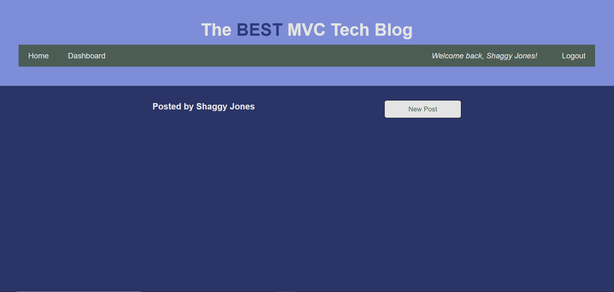

# The BEST MVC-Tech-Blog

## Description
The purpose of this project is to build a a CMS-style blog site similar to a Wordpress site, where developers can publish their blog posts and comment on other developer’s posts. This project utilizes Node.js, Express, Sequelize, Handlebars, and MySQL, among other npm packages. This project follows the MVC paradigm. Acceptance Criteria have been broken down into individual features (e.g. AC01). For details on the implementation, review the applicable 'Usage' section of this README.

In short, this application allows the user to create an account and login and see blogposts left by other users, comment on those posts, and add their own blogposts. A user can delete or update any of their own blogposts and delete any comments applied to their own blogposts.  

### User Story

* AS A developer who writes about tech
I WANT a CMS style blog site
SO THAT I can publish articles, blog posts, and my thoughts and opinions

### Acceptance Criteria

>* GIVEN a CMS-style blog site

>* AC01: Homepage Components
>    -	WHEN I visit the site for the first time
>    -	THEN I am presented with the homepage, which includes:
>       -   existing blog posts if any have been posted
>       -   navigation links for the homepage and the dashboard
>       -   the option to log in

>* AC02: Homepage Option
>    -	WHEN I click on the homepage option
>    -	THEN I am taken to the homepage

>* AC03: Login/Sign-in Prompt
>    -	WHEN I click on any other links in the navigation
>    -	THEN I am prompted to either sign up or sign in

>* AC04: Sign Up Form
>    -	WHEN I choose to sign up
>    -	THEN I am prompted to create a username and password

>* AC05: Sign Up Function 
>    -	WHEN I click on the sign up button
>    -	THEN my user credentials are saved and I am logged into the site

>* AC06: Login Form 
>    -	WHEN I revisit the site at a later time and choose to sign in
>    -	THEN I am prompted to enter my username and password

>* AC07: Logged In Components 
>    -	WHEN I am signed in to the site
>    -	THEN I see navigation links for the homepage, the dashboard, and the option to log out

>* AC08: Homepage Blogposts (Title & Date Created Display) 
>    -	WHEN I click on the homepage option in the navigation
>    -	THEN I am taken to the homepage and presented with existing blog posts that include the post title and date created

>* AC09: Blogpost Features
>    -	WHEN I click on an existing blog post
>    -	THEN I am presented with the:
>       -   post title
>       -   contents
>       -   post creator’s username
>       -   date created
>       -   option to leave a comment

>* AC10: Comment Features 
>    -	WHEN I enter a comment and click on the submit button while signed in
>    -	THEN the comment is saved and the post is updated to display:
>       -   the comment
>       -   the comment creator’s username
>       -   the date created

>* AC11: Dashboard Features 
>    -	WHEN I click on the dashboard option in the navigation
>    -	THEN I am taken to the dashboard and presented with any blog posts I have already created and the option to add a new blog post

>* AC12: Add New Blogpost Form 
>    -	WHEN I click on the button to add a new blog post
>    -	THEN I am prompted to enter both a title and contents for my blog post

>* AC13: New Blogpost Creation 
>    -	WHEN I click on the button to create a new blog post
>    -	THEN the title and the contents of my post are saved and I am taken back to an updated dashboard with my new blog post

>* AC14: Logged In User Blogpost Features 
>    -	WHEN I click on one of my existing posts in the dashboard
>    -	THEN I am able to delete or update my post and taken back to an updated dashboard

>* AC15: Log Out Function 
>    -	WHEN I click on the logout option in the navigation
>    -	THEN I am signed out of the site

>* AC16: Logged In Timeout 
>    -	WHEN I am idle on the site for more than a set time
>    -	THEN I am able to view posts and comments but I am prompted to log in again before I can add, update, or delete posts

## Installation

> * To access the deployed application, open the browser and paste the following URL in the address bar, or click on the link: https://crazy-good-mvc-tech-blog-d7c213925153.herokuapp.com
> * To access the project repo, open the browser and paste the following URL in the address bar, or click on the link: https://github.com/recenasu/MVC-Tech-Blog

## Usage

The following paragraphs and screenshots step through the application meeting the Acceptance Criteria identified by number (e.g. AC01, reference the Acceptance Criteria section):

> * The following screen shows the initial homepage components satisfying AC01 and AC02

> * The following screen shows the login and signup forms satisfying AC03 and AC04

> * The following 2 screens show the signup function satisfying AC05

> * The following screen shows the logout function satisfying AC15

> * The following 2 screens show the login function satisfying AC06

> * The following screen shows the logged in components satisfying AC07 and the Homepage Blogposts Titles and Dates satisfying AC08

> * The following 2 screens show the blogpost features satisfying AC09

> * The following 3 screens show the comment features satisfying AC10

> * The following 2 screens show the dashboard features satisfying AC11

> * The following 2 screens show the new blogpost features satisfying AC12 and AC13

> * The following 10 screens show the logged in user blogpost features satisfying AC14

> * NOTE: AC15 was satisfied in the earlier screenshots

> * The following screen shows the session maxAge setting in the server.js file, satisfying AC16

## Credits

> * npm express v4.17.1 module was used for managing API routes.
> * npm dotenv v16.3.1 module was used for environment variable security.
> * npm sequelize v6.3.5 module was used for managing database calls.
> * npm mysql12 v3.6.0 module was used as the database application.
> * express-handlebars v5.2.0 was used for webpage templates
> * express-session v1.17.1 was used for managing client sessions
> * refer to package.json for these and any other dependencies.

